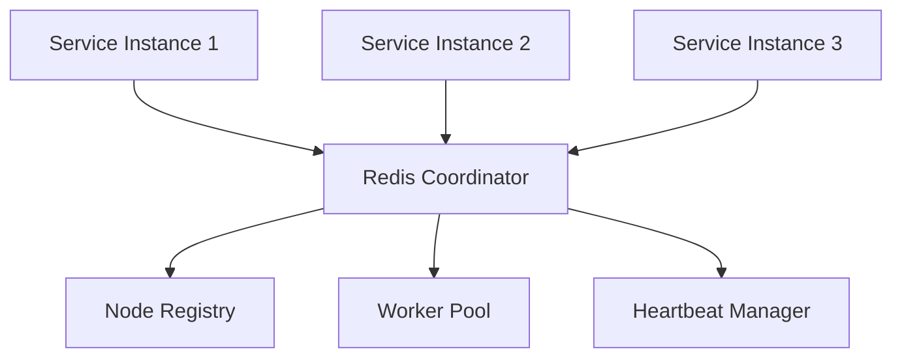

# Snowflake ID Generator

A high-performance, distributed Snowflake ID generator for Python with support for asyncio and microservice architectures.

## Features

- 🚀 **High Performance**: Generate millions of unique IDs per second
- 🔄 **Async/Sync Support**: Both `async`/`await` and synchronous generation
- 🌐 **Distributed Coordination**: Redis-based coordination for microservices
- ⚙️ **Configurable**: Flexible bit allocation for different use cases
- 🛡️ **Production Ready**: Clock skew detection, health checks, graceful shutdown
- 📦 **Easy Integration**: Simple pip install with optional dependencies

## Installation

```bash
# Basic installation
pip install snowflakeid

# With Redis coordination support
pip install snowflakeid[redis]

# With all optional features
pip install snowflakeid[all]
```

## Quick Start

### Basic Usage

```python
from snowflakeid import SnowflakeGenerator, SnowflakeIDConfig

# Create configuration
config = SnowflakeIDConfig(
    node_id=1,
    worker_id=1
)

# Create generator
generator = SnowflakeGenerator(config)

# Generate unique IDs
id1 = generator.generate_sync()
id2 = generator.generate_sync()

print(f"Generated IDs: {id1}, {id2}")

# Base62 encoding for shorter strings
encoded = generator.encode_base62(id1)
decoded = generator.decode_base62(encoded)
print(f"Encoded: {encoded}, Decoded: {decoded}")

# Extract ID components
info = generator.extract_snowflake_info(id1)
print(f"Timestamp: {info.readable_timestamp}")
print(f"Node: {info.node_id}, Worker: {info.worker_id}")
```

### Async Usage with Enhanced Features

```python
import asyncio
from snowflakeid import EnhancedSnowflakeGenerator, EnhancedSnowflakeIDConfig

async def main():
    # Environment-aware configuration
    config = EnhancedSnowflakeIDConfig.for_environment("production")
    
    # Create and initialize generator
    generator = EnhancedSnowflakeGenerator(config)
    await generator.initialize()
    
    # Generate individual IDs
    id1 = await generator.generate()
    
    # Batch generation for high throughput
    batch = await generator.generate_batch(100)
    
    # Get performance statistics
    stats = generator.get_stats()
    print(f"Generated {stats['generation_count']} IDs")
    
    # Health check
    health = await generator.health_check()
    print(f"Healthy: {health['healthy']}")
    
    await generator.shutdown()

asyncio.run(main())
```

### Distributed Coordination (Microservices)

```python
import asyncio
from snowflakeid import (
    EnhancedSnowflakeGenerator, 
    EnhancedSnowflakeIDConfig,
    DistributedConfig
)

async def microservice_example():
    # Configure Redis coordination
    distributed_config = DistributedConfig(
        backend_type="redis",
        connection_params={"url": "redis://localhost:6379/0"},
        node_id_ttl=300,
        heartbeat_interval=30
    )
    
    config = EnhancedSnowflakeIDConfig(
        environment="production",
        auto_discover_node_id=True,      # Automatically claim unique node ID
        auto_discover_worker_id=True,    # Automatically claim unique worker ID
        distributed_config=distributed_config,
        fallback_strategy="local_cache"  # Fallback if Redis unavailable
    )
    
    generator = EnhancedSnowflakeGenerator(config)
    await generator.initialize()
    
    print(f"Auto-assigned Node ID: {generator.config.node_id}")
    print(f"Auto-assigned Worker ID: {generator.config.worker_id}")
    
    # Generate globally unique IDs across multiple service instances
    unique_id = await generator.generate()
    print(f"Globally unique ID: {unique_id}")
    
    await generator.shutdown()

asyncio.run(microservice_example())
```

## Configuration

### Environment-Based Configuration

```python
from snowflakeid import EnhancedSnowflakeIDConfig

# Built-in environment configurations
dev_config = EnhancedSnowflakeIDConfig.for_environment("development")
prod_config = EnhancedSnowflakeIDConfig.for_environment("production")

# Custom environment configuration
custom_config = EnhancedSnowflakeIDConfig.for_environment(
    "production",
    node_id=5,
    worker_id=2,
    batch_size=200
)
```

### Configuration Files

Create `config/production.yaml`:

```yaml
environment: production
epoch: 1420070400000  # 2015-01-01 UTC
time_bits: 41
node_bits: 5
worker_bits: 5
auto_discover_node_id: true
auto_discover_worker_id: true

distributed_config:
  backend_type: redis
  connection_params:
    url: redis://redis-cluster:6379/0
  node_id_ttl: 300
  heartbeat_interval: 30

enable_batch_generation: true
batch_size: 100
pool_size: 1000
```

Load configuration:

```python
from snowflakeid import ConfigurationLoader

config = ConfigurationLoader.load_config("config/production.yaml")
generator = EnhancedSnowflakeGenerator(config)
```

### Environment Variables

```bash
export SNOWFLAKE_ENV=production
export SNOWFLAKE_NODE_ID=5
export SNOWFLAKE_WORKER_ID=2
export SNOWFLAKE_AUTO_DISCOVER_NODE_ID=true
export SNOWFLAKE_DISTRIBUTED_BACKEND_TYPE=redis
export SNOWFLAKE_DISTRIBUTED_CONNECTION_PARAMS='{"url": "redis://localhost:6379"}'
```

```python
from snowflakeid import ConfigurationLoader

config = ConfigurationLoader.from_environment_variables()
```

## Performance

### Throughput Benchmarks

| Mode | Throughput | Use Case |
|------|------------|----------|
| Basic Sync | ~500K IDs/sec | Single-threaded apps |
| Enhanced Async | ~1M IDs/sec | Async applications |
| Batch Generation | ~10M IDs/sec | High-throughput services |

### Memory Usage

- Basic generator: ~1KB memory footprint
- Enhanced generator: ~10KB + ID pool (configurable)
- Distributed coordination: +~5KB for coordination state

## ID Structure

Snowflake IDs are 64-bit integers composed of:

```
|--Timestamp (41 bits)--|--Node (5 bits)--|--Worker (5 bits)--|--Sequence (13 bits)--|
```

### Default Bit Allocation

- **Timestamp (41 bits)**: ~69 years from epoch (2015-01-01)
- **Node ID (5 bits)**: 32 nodes maximum
- **Worker ID (5 bits)**: 32 workers per node
- **Sequence (13 bits)**: 8,192 IDs per millisecond per worker

### Custom Bit Allocation

```python
config = EnhancedSnowflakeIDConfig(
    time_bits=42,   # ~139 years
    node_bits=6,    # 64 nodes
    worker_bits=4,  # 16 workers per node
    # sequence_bits automatically calculated (12 bits = 4,096 IDs/ms)
)
```

## Architecture

### Distributed Coordination



### High Availability

- **Automatic failover**: Dead nodes/workers are detected and recycled
- **Graceful degradation**: Falls back to local mode if coordination fails
- **Health monitoring**: Built-in health checks and metrics
- **Circuit breaker**: Protects against coordination backend failures

## Use Cases

### Microservices

```python
# Each microservice instance gets unique node/worker IDs
config = EnhancedSnowflakeIDConfig.for_environment("production")
config.auto_discover_node_id = True
config.auto_discover_worker_id = True
```

### Database Sharding

```python
# Generate IDs for database records
user_id = await generator.generate()
order_id = await generator.generate()

# IDs are naturally sortable by creation time
assert user_id < order_id  # user was created before order
```

### Event Sourcing

```python
# Generate event IDs
event_id = generator.generate_sync()

# Extract timestamp for event ordering
info = generator.extract_snowflake_info(event_id)
event_timestamp = info.timestamp_ms
```

### API Rate Limiting

```python
# Generate request IDs for tracking
request_id = await generator.generate()
```

## Monitoring

### Health Checks

```python
health = await generator.health_check()
print(f"Status: {'✓' if health['healthy'] else '✗'}")
print(f"Generation time: {health['generation_time_ms']:.2f}ms")
print(f"Coordination: {'✓' if health['coordination_healthy'] else '✗'}")
```

### Metrics

```python
stats = generator.get_stats()
print(f"Total IDs: {stats['generation_count']}")
print(f"Rate: {stats['generation_rate']:.0f} IDs/second")
print(f"Errors: {stats['error_count']}")
print(f"Pool size: {stats['pool_size']}")
```

### Integration with Monitoring Systems

```python
# Prometheus metrics example
from prometheus_client import Counter, Histogram

ids_generated = Counter('snowflake_ids_total')
generation_time = Histogram('snowflake_generation_seconds')

@generation_time.time()
async def generate_tracked_id():
    id_val = await generator.generate()
    ids_generated.inc()
    return id_val
```

## Best Practices

### Production Deployment

1. **Use environment-specific epochs**: Different epochs for dev/staging/prod
2. **Enable distributed coordination**: Prevents ID collisions across instances
3. **Configure appropriate bit allocation**: Balance timestamp range vs. node capacity
4. **Set up monitoring**: Track generation rate and error rates
5. **Plan for growth**: Reserve node/worker IDs for future scaling

### Performance Optimization

1. **Use batch generation**: For high-throughput scenarios
2. **Enable ID pooling**: Reduces lock contention
3. **Tune pool size**: Balance memory usage vs. performance
4. **Monitor health**: Set up alerts for degraded performance

### Error Handling

```python
from snowflakeid import EnhancedSnowflakeGenerator

async def robust_id_generation():
    try:
        return await generator.generate()
    except RuntimeError as e:
        if "clock moved backwards" in str(e):
            # Handle clock skew
            await asyncio.sleep(0.001)
            return await generator.generate()
        raise
    except Exception as e:
        # Log error and potentially fall back to alternative ID generation
        logger.error(f"ID generation failed: {e}")
        raise
```

## Migration from Twitter Snowflake

If migrating from Twitter's Snowflake implementation:

```python
# Twitter-compatible configuration
config = EnhancedSnowflakeIDConfig(
    epoch=1288834974657,  # Twitter's epoch
    time_bits=41,
    node_bits=10,         # Twitter uses datacenter + machine ID
    worker_bits=0,        # Twitter doesn't use worker concept
    sequence_bits=12
)
```

## Contributing

Contributions are welcome! Please see [CONTRIBUTING.md](CONTRIBUTING.md) for guidelines.

## License

MIT License - see [LICENSE](LICENSE) for details.

## Changelog

### v0.2.0
- Added distributed coordination with Redis
- Environment-aware configuration
- Batch generation for high throughput
- Health checks and monitoring
- Graceful shutdown handling

### v0.1.0
- Initial release with basic Snowflake ID generation
- Sync/async support
- Base62 encoding
- Configurable bit allocation
