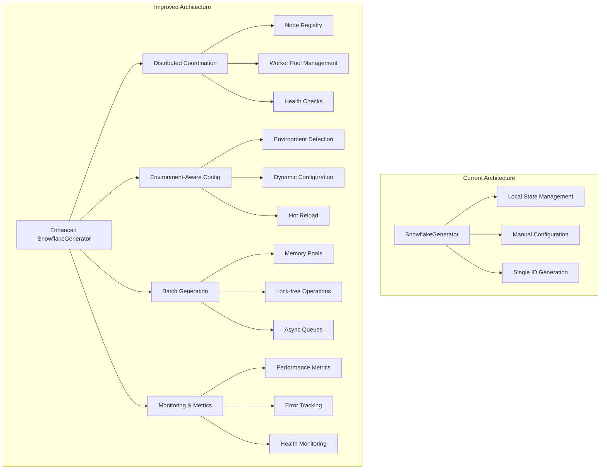
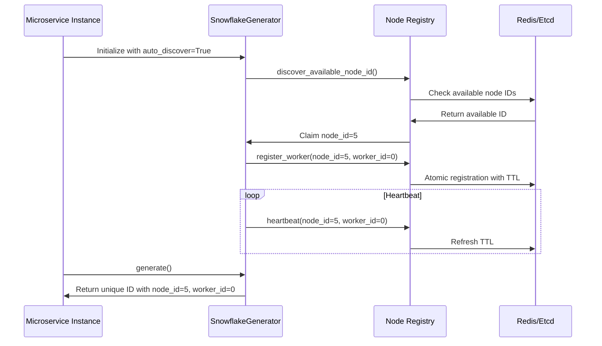
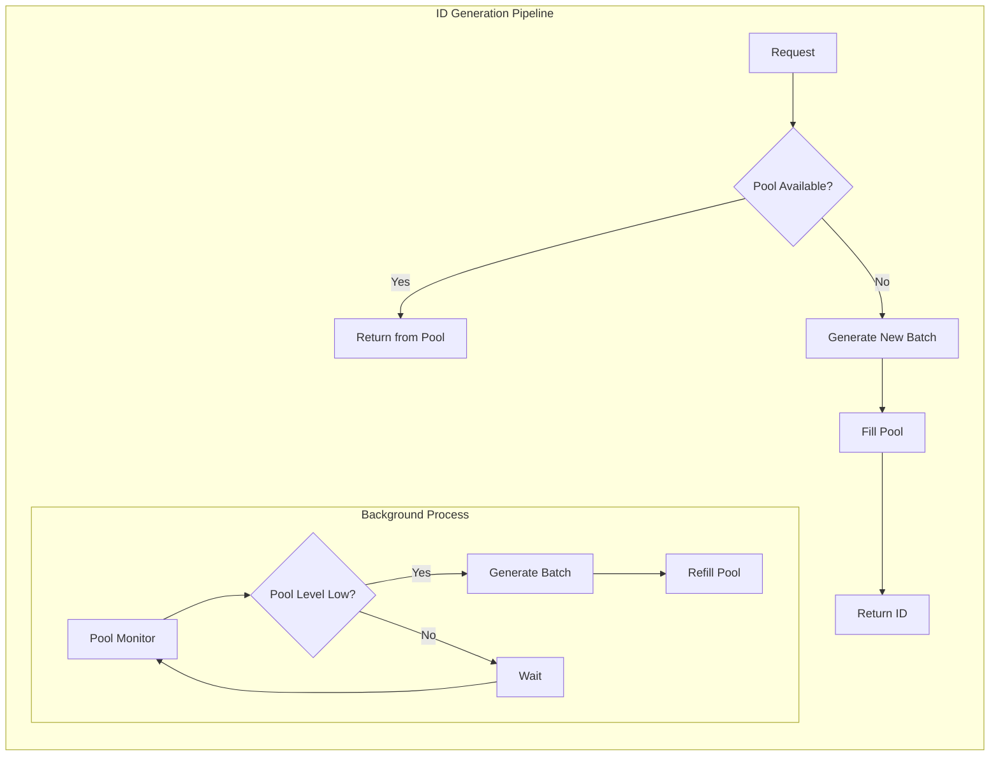

# Snowflake ID Generator - Architecture Review & Improvement Plan

## Executive Summary

This document provides a comprehensive review of the [`snowflakeid/generator.py`](snowflakeid/generator.py:1) implementation and presents a detailed improvement plan for enterprise-grade microservice deployments with distributed databases across multiple locations.

## Current Implementation Analysis

### Strengths ✅

1. **Well-structured Architecture**
   - Clean separation of concerns with [`SnowflakeIDConfig`](snowflakeid/generator.py:13), [`SnowflakeInfo`](snowflakeid/generator.py:106), and [`SnowflakeGenerator`](snowflakeid/generator.py:117)
   - Comprehensive bit allocation validation in [`_validate_config()`](snowflakeid/generator.py:54)
   - Proper use of dataclasses with frozen configuration

2. **Dual Operation Modes**
   - Async support via [`generate()`](snowflakeid/generator.py:150) method
   - Sync support via [`generate_sync()`](snowflakeid/generator.py:383) method
   - Separate locking mechanisms for thread-safety and async-safety

3. **Robust Error Handling**
   - Clock skew detection in both async and sync methods
   - Sequence overflow handling with [`_wait_next_millis()`](snowflakeid/generator.py:226)
   - Comprehensive validation of configuration parameters

4. **Additional Features**
   - Base62 encoding/decoding via [`encode_base62()`](snowflakeid/generator.py:242) and [`decode_base62()`](snowflakeid/generator.py:266)
   - ID component extraction via [`extract_snowflake_info()`](snowflakeid/generator.py:295)
   - Flexible bit allocation for different use cases (32, 48, 64, 96-bit configurations)

### Critical Issues for Microservice Scalability ⚠️

1. **No Distributed Coordination**
   - Multiple instances can generate duplicate IDs
   - No mechanism for node/worker ID distribution
   - Risk of collisions in distributed environments

2. **Hardcoded Configuration**
   - [`DEFAULT_EPOCH_MS`](snowflakeid/generator.py:8) is fixed across environments
   - No environment-specific configuration support
   - Manual node/worker ID assignment required

3. **Performance Limitations**
   - Sequential ID generation under locks
   - No batch generation capabilities
   - Potential bottlenecks in high-throughput scenarios

4. **Missing Enterprise Features**
   - No monitoring or observability
   - No graceful degradation strategies
   - Limited error recovery mechanisms

## Architecture Improvement Plan

### Overview Diagram



## Phase 1: Distributed Coordination (Priority: High)

### Node/Worker ID Management

```python
@dataclass(frozen=True)
class DistributedConfig:
    """Configuration for distributed coordination backend."""
    backend_type: str = "redis"  # redis, etcd, consul, zookeeper
    connection_params: Dict[str, Any] = field(default_factory=dict)
    node_id_ttl: int = 300  # seconds
    worker_pool_size: int = 32
    heartbeat_interval: int = 30  # seconds
    registration_timeout: int = 10  # seconds

@dataclass(frozen=True)
class EnhancedSnowflakeIDConfig(SnowflakeIDConfig):
    """Extended configuration with distributed coordination."""
    auto_discover_node_id: bool = True
    auto_discover_worker_id: bool = True
    distributed_config: Optional[DistributedConfig] = None
    environment: Optional[str] = None
    fallback_strategy: str = "local_cache"  # local_cache, random, fail
```

### Node Registry Interface

```python
from abc import ABC, abstractmethod
from typing import Protocol

class NodeRegistry(Protocol):
    """Protocol for distributed node coordination backends."""
    
    async def register_node(self, node_id: int, metadata: Dict[str, Any]) -> bool:
        """Register a node with the distributed registry."""
        
    async def discover_available_node_id(self) -> int:
        """Find and claim an available node ID."""
        
    async def register_worker(self, node_id: int, worker_id: int) -> bool:
        """Register a worker within a node."""
        
    async def heartbeat(self, node_id: int, worker_id: int) -> bool:
        """Send heartbeat to maintain registration."""
        
    async def cleanup_expired_registrations(self) -> int:
        """Clean up expired node/worker registrations."""

class RedisNodeRegistry:
    """Redis-based implementation of NodeRegistry."""
    
    def __init__(self, redis_config: Dict[str, Any]):
        self.redis_config = redis_config
        self.redis_client = None
        
    async def register_node(self, node_id: int, metadata: Dict[str, Any]) -> bool:
        """Implementation using Redis with TTL and atomic operations."""
        # Use Redis SETNX with TTL for atomic node registration
        # Store metadata as JSON in Redis hash
        pass
```

### Distributed Coordination Flow



## Phase 2: Performance Optimizations (Priority: High)

### Batch Generation Architecture

```python
class PerformanceOptimizedGenerator(SnowflakeGenerator):
    """Enhanced generator with performance optimizations."""
    
    def __init__(self, config: EnhancedSnowflakeIDConfig):
        super().__init__(config)
        self.id_pool = asyncio.Queue(maxsize=1000)
        self.pool_refill_task = None
        self.batch_size = 100
        
    async def generate_batch(self, count: int) -> List[int]:
        """Generate multiple IDs efficiently in a single lock acquisition."""
        if count > 1000:
            raise ValueError("Batch size too large, maximum 1000 IDs per batch")
            
        async with self.async_lock:
            ids = []
            for _ in range(count):
                ids.append(self._generate_without_lock())
            return ids
    
    async def _generate_without_lock(self) -> int:
        """Generate ID without acquiring lock (lock must be held by caller)."""
        # Optimized version of the generation logic
        # Assumes lock is already held
        pass
        
    async def _refill_id_pool(self):
        """Background task to maintain a pool of pre-generated IDs."""
        while True:
            try:
                if self.id_pool.qsize() < 100:
                    batch = await self.generate_batch(self.batch_size)
                    for id_val in batch:
                        await self.id_pool.put(id_val)
                await asyncio.sleep(0.01)  # Small delay to prevent busy waiting
            except Exception as e:
                # Log error and continue
                await asyncio.sleep(1)  # Longer delay on error
```

### Memory Pool Management



## Phase 3: Environment-Aware Configuration (Priority: Medium)

### Configuration Management

```python
class EnvironmentConfig:
    """Environment-specific configuration management."""
    
    ENVIRONMENT_EPOCHS = {
        "development": 1723323246031,    # Current default
        "staging": 1723323246031,       # Same as dev for consistency
        "production": 1420070400000,    # 2015-01-01 UTC
        "test": 1577836800000,          # 2020-01-01 UTC
    }
    
    ENVIRONMENT_DEFAULTS = {
        "development": {
            "time_bits": 39,
            "node_bits": 7,
            "worker_bits": 5,
            "auto_discover_node_id": False,
        },
        "production": {
            "time_bits": 41,  # Longer timestamp duration
            "node_bits": 5,   # Fewer nodes, more workers
            "worker_bits": 5,
            "auto_discover_node_id": True,
        }
    }
    
    @classmethod
    def for_environment(cls, env: str = None) -> EnhancedSnowflakeIDConfig:
        """Create configuration optimized for specific environment."""
        env = env or os.getenv('SNOWFLAKE_ENV', 'development')
        
        base_config = cls.ENVIRONMENT_DEFAULTS.get(env, cls.ENVIRONMENT_DEFAULTS['development'])
        epoch = cls.ENVIRONMENT_EPOCHS.get(env, cls.ENVIRONMENT_EPOCHS['development'])
        
        return EnhancedSnowflakeIDConfig(
            epoch=epoch,
            environment=env,
            **base_config
        )
```

### Dynamic Configuration Loading

```python
class ConfigurationLoader:
    """Supports loading configuration from various sources."""
    
    @staticmethod
    def from_file(path: str) -> EnhancedSnowflakeIDConfig:
        """Load configuration from YAML/JSON file."""
        with open(path, 'r') as f:
            if path.endswith('.yaml') or path.endswith('.yml'):
                data = yaml.safe_load(f)
            else:
                data = json.load(f)
        return EnhancedSnowflakeIDConfig(**data)
    
    @staticmethod
    async def from_consul(consul_client, key: str) -> EnhancedSnowflakeIDConfig:
        """Load configuration from Consul KV store."""
        index, data = await consul_client.kv.get(key)
        if data is None:
            raise ValueError(f"Configuration not found at key: {key}")
        config_data = json.loads(data['Value'].decode())
        return EnhancedSnowflakeIDConfig(**config_data)
    
    @staticmethod
    def from_environment_variables() -> EnhancedSnowflakeIDConfig:
        """Load configuration from environment variables."""
        config_dict = {}
        for key, value in os.environ.items():
            if key.startswith('SNOWFLAKE_'):
                config_key = key[10:].lower()  # Remove SNOWFLAKE_ prefix
                config_dict[config_key] = value
        return EnhancedSnowflakeIDConfig(**config_dict)
```

## Phase 4: Monitoring & Observability (Priority: Medium)

### Metrics Collection

```python
@dataclass
class SnowflakeMetrics:
    """Comprehensive metrics for Snowflake ID generation."""
    
    # Performance metrics
    generation_rate: float = 0.0
    average_latency_ms: float = 0.0
    p95_latency_ms: float = 0.0
    p99_latency_ms: float = 0.0
    
    # Error metrics
    error_rate: float = 0.0
    sequence_overflow_count: int = 0
    clock_skew_incidents: int = 0
    coordination_failures: int = 0
    
    # Resource metrics
    active_generators: int = 0
    pool_size: int = 0
    pool_utilization: float = 0.0
    
    # Business metrics
    total_ids_generated: int = 0
    unique_nodes_active: int = 0
    unique_workers_active: int = 0

class MetricsCollector:
    """Collects and reports metrics for Snowflake ID generation."""
    
    def __init__(self):
        self.metrics = SnowflakeMetrics()
        self.start_time = time.time()
        self.generation_times = deque(maxlen=1000)
        
    def record_generation(self, generation_time: float):
        """Record the time taken to generate an ID."""
        self.generation_times.append(generation_time)
        self.metrics.total_ids_generated += 1
        
    def record_error(self, error_type: str):
        """Record different types of errors."""
        if error_type == "sequence_overflow":
            self.metrics.sequence_overflow_count += 1
        elif error_type == "clock_skew":
            self.metrics.clock_skew_incidents += 1
        elif error_type == "coordination_failure":
            self.metrics.coordination_failures += 1
            
    def get_current_metrics(self) -> SnowflakeMetrics:
        """Calculate and return current metrics."""
        if self.generation_times:
            sorted_times = sorted(self.generation_times)
            self.metrics.average_latency_ms = statistics.mean(sorted_times) * 1000
            self.metrics.p95_latency_ms = statistics.quantiles(sorted_times, n=20)[18] * 1000
            self.metrics.p99_latency_ms = statistics.quantiles(sorted_times, n=100)[98] * 1000
            
        elapsed_time = time.time() - self.start_time
        if elapsed_time > 0:
            self.metrics.generation_rate = self.metrics.total_ids_generated / elapsed_time
            
        return self.metrics
```

### Health Checks

```python
@dataclass
class HealthStatus:
    """Health check status information."""
    healthy: bool
    component: str
    message: str
    timestamp: datetime
    details: Dict[str, Any] = field(default_factory=dict)

class SnowflakeHealthCheck:
    """Comprehensive health checking for Snowflake ID generators."""
    
    def __init__(self, generator: PerformanceOptimizedGenerator):
        self.generator = generator
        
    async def check_generator_health(self) -> HealthStatus:
        """Check the health of the ID generator itself."""
        try:
            start_time = time.time()
            test_id = await self.generator.generate()
            generation_time = time.time() - start_time
            
            if generation_time > 0.1:  # 100ms threshold
                return HealthStatus(
                    healthy=False,
                    component="generator",
                    message=f"Slow generation: {generation_time:.3f}s",
                    timestamp=datetime.utcnow(),
                    details={"generation_time": generation_time, "test_id": test_id}
                )
                
            return HealthStatus(
                healthy=True,
                component="generator", 
                message="Generator working normally",
                timestamp=datetime.utcnow(),
                details={"generation_time": generation_time, "test_id": test_id}
            )
            
        except Exception as e:
            return HealthStatus(
                healthy=False,
                component="generator",
                message=f"Generation failed: {str(e)}",
                timestamp=datetime.utcnow(),
                details={"error": str(e), "error_type": type(e).__name__}
            )
    
    async def check_coordination_backend(self) -> HealthStatus:
        """Check the health of the distributed coordination backend."""
        if not hasattr(self.generator, 'node_registry'):
            return HealthStatus(
                healthy=True,
                component="coordination",
                message="No distributed coordination configured",
                timestamp=datetime.utcnow()
            )
            
        try:
            # Test the coordination backend with a simple operation
            result = await self.generator.node_registry.heartbeat(
                self.generator.config.node_id,
                self.generator.config.worker_id
            )
            
            return HealthStatus(
                healthy=result,
                component="coordination",
                message="Coordination backend accessible" if result else "Coordination backend failed",
                timestamp=datetime.utcnow(),
                details={"heartbeat_result": result}
            )
            
        except Exception as e:
            return HealthStatus(
                healthy=False,
                component="coordination",
                message=f"Coordination backend error: {str(e)}",
                timestamp=datetime.utcnow(),
                details={"error": str(e), "error_type": type(e).__name__}
            )
    
    async def full_health_check(self) -> Dict[str, HealthStatus]:
        """Perform a comprehensive health check of all components."""
        checks = await asyncio.gather(
            self.check_generator_health(),
            self.check_coordination_backend(),
            return_exceptions=True
        )
        
        return {
            "generator": checks[0] if not isinstance(checks[0], Exception) else HealthStatus(
                healthy=False, component="generator", message=str(checks[0]), timestamp=datetime.utcnow()
            ),
            "coordination": checks[1] if not isinstance(checks[1], Exception) else HealthStatus(
                healthy=False, component="coordination", message=str(checks[1]), timestamp=datetime.utcnow()
            )
        }
```

## Phase 5: Enterprise Features (Priority: Low)

### Circuit Breaker Pattern

```python
from enum import Enum
from dataclasses import dataclass
import time

class CircuitState(Enum):
    CLOSED = "closed"
    OPEN = "open" 
    HALF_OPEN = "half_open"

@dataclass
class CircuitBreakerConfig:
    failure_threshold: int = 5
    recovery_timeout: int = 60
    half_open_max_calls: int = 3
    failure_rate_threshold: float = 0.5

class CircuitBreaker:
    """Circuit breaker for protecting against cascading failures."""
    
    def __init__(self, config: CircuitBreakerConfig):
        self.config = config
        self.state = CircuitState.CLOSED
        self.failure_count = 0
        self.last_failure_time = 0
        self.half_open_calls = 0
        
    async def call(self, func, *args, **kwargs):
        """Execute function with circuit breaker protection."""
        if self.state == CircuitState.OPEN:
            if time.time() - self.last_failure_time > self.config.recovery_timeout:
                self.state = CircuitState.HALF_OPEN
                self.half_open_calls = 0
            else:
                raise Exception("Circuit breaker is OPEN")
                
        if self.state == CircuitState.HALF_OPEN:
            if self.half_open_calls >= self.config.half_open_max_calls:
                raise Exception("Circuit breaker HALF_OPEN limit exceeded")
            self.half_open_calls += 1
            
        try:
            result = await func(*args, **kwargs)
            self._on_success()
            return result
        except Exception as e:
            self._on_failure()
            raise
            
    def _on_success(self):
        """Handle successful operation."""
        if self.state == CircuitState.HALF_OPEN:
            self.state = CircuitState.CLOSED
        self.failure_count = 0
        
    def _on_failure(self):
        """Handle failed operation.""" 
        self.failure_count += 1
        self.last_failure_time = time.time()
        
        if self.failure_count >= self.config.failure_threshold:
            self.state = CircuitState.OPEN
```

### Graceful Shutdown

```python
class GracefulShutdownHandler:
    """Handles graceful shutdown of Snowflake ID generators."""
    
    def __init__(self, generator: PerformanceOptimizedGenerator):
        self.generator = generator
        self.shutdown_event = asyncio.Event()
        
    async def shutdown(self, timeout: int = 30):
        """Gracefully shutdown the generator."""
        self.shutdown_event.set()
        
        # Stop background tasks
        if hasattr(self.generator, 'pool_refill_task') and self.generator.pool_refill_task:
            self.generator.pool_refill_task.cancel()
            
        # Unregister from coordination backend
        if hasattr(self.generator, 'node_registry'):
            try:
                await asyncio.wait_for(
                    self.generator.node_registry.unregister_node(
                        self.generator.config.node_id
                    ),
                    timeout=timeout
                )
            except asyncio.TimeoutError:
                pass  # Log warning but continue shutdown
                
        # Drain ID pool
        remaining_ids = []
        while not self.generator.id_pool.empty():
            try:
                remaining_ids.append(self.generator.id_pool.get_nowait())
            except asyncio.QueueEmpty:
                break
                
        return {
            "drained_ids": len(remaining_ids),
            "final_sequence": self.generator.sequence,
            "last_timestamp": self.generator.last_timestamp
        }
```

## Implementation Roadmap

### Week 1-2: Foundation (Critical)
- [ ] Implement [`EnhancedSnowflakeIDConfig`](SNOWFLAKE_ARCHITECTURE_REVIEW.md:47) with distributed coordination options
- [ ] Create [`NodeRegistry`](SNOWFLAKE_ARCHITECTURE_REVIEW.md:76) protocol and Redis implementation
- [ ] Add environment-aware configuration loading
- [ ] Update [`SnowflakeGenerator`](snowflakeid/generator.py:117) to support auto-discovery

### Week 3-4: Performance (High Priority)
- [ ] Implement [`PerformanceOptimizedGenerator`](SNOWFLAKE_ARCHITECTURE_REVIEW.md:132) with batch generation
- [ ] Add memory pool management with background refill
- [ ] Optimize lock-free operations where possible
- [ ] Add comprehensive benchmarking suite

### Month 2: Monitoring & Reliability (Medium Priority)
- [ ] Implement [`MetricsCollector`](SNOWFLAKE_ARCHITECTURE_REVIEW.md:205) and [`SnowflakeHealthCheck`](SNOWFLAKE_ARCHITECTURE_REVIEW.md:247)
- [ ] Add circuit breaker pattern for coordination backend
- [ ] Implement graceful shutdown procedures
- [ ] Create monitoring dashboard

### Month 3+: Advanced Features (Low Priority)
- [ ] Multi-region support with region-aware node IDs
- [ ] Hot-reload configuration capabilities
- [ ] Advanced analytics and reporting
- [ ] Integration with service mesh (Istio, Linkerd)

## Configuration Examples

### Development Environment
```yaml
# config/development.yaml
environment: development
epoch: 1723323246031
total_bits: 64
time_bits: 39
node_bits: 7
worker_bits: 5
node_id: 0
worker_id: 0
auto_discover_node_id: false
auto_discover_worker_id: false
```

### Production Microservice
```yaml
# config/production.yaml
environment: production
epoch: 1420070400000
total_bits: 64
time_bits: 41
node_bits: 5
worker_bits: 5
auto_discover_node_id: true
auto_discover_worker_id: true
distributed_config:
  backend_type: redis
  connection_params:
    host: redis-cluster.internal
    port: 6379
    db: 0
    cluster_mode: true
    ssl: true
  node_id_ttl: 300
  worker_pool_size: 32
  heartbeat_interval: 30
fallback_strategy: local_cache
```

### Kubernetes Deployment
```yaml
apiVersion: apps/v1
kind: Deployment
metadata:
  name: microservice-with-snowflake
spec:
  template:
    spec:
      containers:
      - name: app
        env:
        - name: SNOWFLAKE_ENV
          value: production
        - name: SNOWFLAKE_CONFIG_PATH
          value: /config/snowflake.yaml
        volumeMounts:
        - name: config
          mountPath: /config
      volumes:
      - name: config
        configMap:
          name: snowflake-config
```

## Risk Assessment & Mitigation

### High Risk
- **ID Collisions in Distributed Environment**: Mitigated by distributed coordination and proper node/worker ID management
- **Coordination Backend Failure**: Mitigated by circuit breaker pattern and fallback strategies

### Medium Risk  
- **Performance Degradation**: Mitigated by batch generation and memory pools
- **Clock Skew Issues**: Already handled in current implementation

### Low Risk
- **Configuration Drift**: Mitigated by centralized configuration management
- **Memory Leaks**: Mitigated by proper pool management and monitoring

## Success Metrics

### Performance Targets
- **Throughput**: 100,000+ IDs/second per instance
- **Latency**: P95 < 1ms, P99 < 5ms
- **Availability**: 99.99% uptime

### Operational Targets
- **Zero ID collisions** in distributed deployment
- **< 5 second** recovery time from coordination backend failures
- **< 30 second** graceful shutdown time

## Conclusion

The current [`snowflakeid/generator.py`](snowflakeid/generator.py:1) implementation provides a solid foundation for Snowflake ID generation. However, for enterprise microservice deployments with distributed databases, significant enhancements are needed in:

1. **Distributed coordination** for collision-free ID generation
2. **Performance optimization** for high-throughput scenarios  
3. **Enterprise features** like monitoring, health checks, and graceful degradation
4. **Environment-aware configuration** for different deployment contexts

Following this roadmap will transform the generator into a production-ready, enterprise-grade solution suitable for large-scale microservice architectures with global distribution requirements.